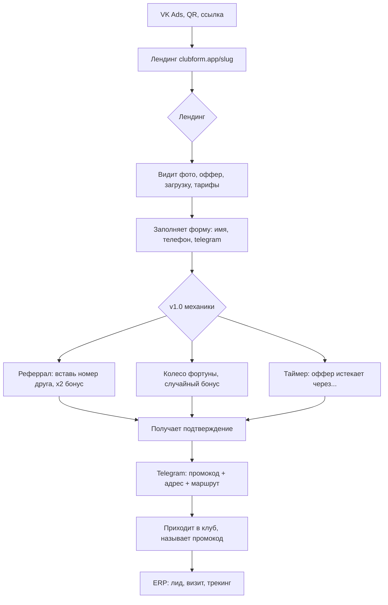
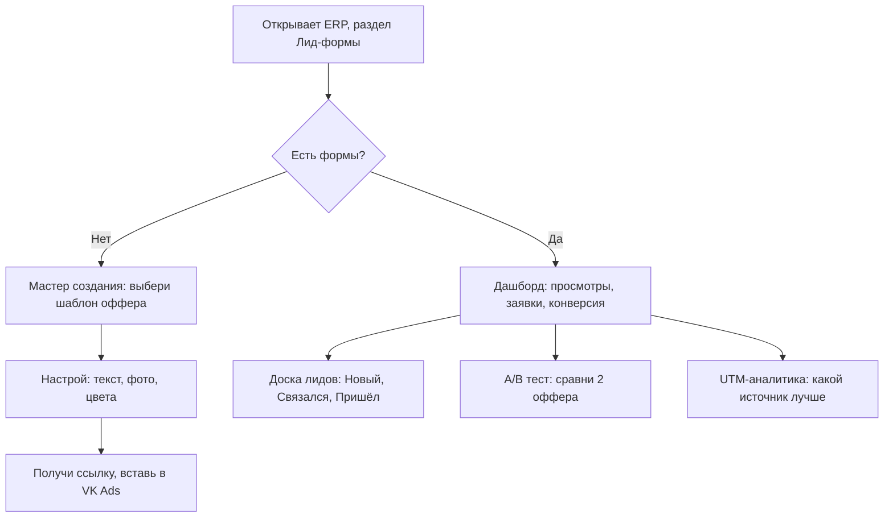

# 🎯 Product Spec: ClubForm — лид-формы для компьютерных клубов

> **Версия:** 1.0 | **Дата:** 2026-03-20
> **Статус:** Draft → на ревью
> **Валидация идеи:** [74/100 🟢](file:///Users/daniilsavinykh/Documents/Antigravity/erp-lootarena/docs/idea-validation/2026-03-20-lead-form-computer-clubs.md)

---

## Проблема

Компьютерные клубы тратят 30-100K руб/мес на рекламу VK, но:

- Нет инструмента конвертации трафика → ведут на группу ВК или сайт без CTA
- Нет аналитики ROI → не знают, какой оффер работает
- Нет единого оффера → у всех разные акции, непонятно что конвертирует лучше
- Нет follow-up → лид заполнил форму, но никто не позвонил / не написал

## Решение

Веб-приложение для создания мини-лендингов с лид-формами. Каждый клуб получает персональную страницу `clubform.app/{slug}` с оффером, формой записи и аналитикой.

## Целевая аудитория

| Сегмент | Кто | Потребность |
|---------|-----|-------------|
| **Primary** | Владелец/управляющий клуба (25-40, предприниматель) | Привлечь новых гостей, видеть ROI рекламы |
| **Secondary** | Маркетолог клуба / сети | A/B тесты, аналитика, масштабирование по точкам |
| **End user** | Геймер (14-30, ищет клуб рядом) | Получить выгодный оффер, записаться быстро |

---

## Архитектура продукта

```
┌──────────────────────────────────────────────────┐
│                   ERP LootArena                   │
│  erp_clubs · тарифы · загрузка · зоны · guests   │
└──────────────┬───────────────────────────────────┘
               │ API / DB
┌──────────────▼───────────────────────────────────┐
│              ClubForm Backend (n8n)               │
│  Webhooks · CRM · Follow-up · Notifications      │
└──────────────┬───────────────────────────────────┘
               │
┌──────────────▼───────────────────────────────────┐
│           ClubForm Frontend (React/Next)          │
│                                                   │
│  ┌─────────────┐  ┌──────────────┐  ┌──────────┐│
│  │  Лендинг    │  │  Конструктор │  │ Dashboard ││
│  │  (публичный)│  │  (для клуба) │  │ аналитики ││
│  └─────────────┘  └──────────────┘  └──────────┘│
└──────────────────────────────────────────────────┘
```

---

## Фичи по версиям

### MVP (2 недели)

> Цель: доказать что клубы пользуются и гости заполняют

| # | Фича | Описание | Приоритет |
|---|------|----------|-----------|
| 1 | **Мини-лендинг** | Адаптивная страница `clubform.app/{slug}` с лого, фото, оффером | Must |
| 2 | **Шаблоны офферов (3 шт)** | «Первый час бесплатно», «Приведи друга», «Ночной пакет» — выбрать и опубликовать | Must |
| 3 | **Форма записи** | Имя, телефон, Telegram (опц.) — 3 поля максимум | Must |
| 4 | **Брендирование** | Лого + основной цвет клуба из `erp_clubs` автоматически | Must |
| 5 | **UTM-аналитика** | Парсинг utm_source/medium/campaign, привязка к каждому лиду | Must |
| 6 | **Пуш администратору** | Telegram-уведомление при новом лиде: имя, телефон, оффер, UTM | Must |
| 7 | **Доска лидов** | Простой список заявок в ERP: Новый → Связался → Пришёл | Must |
| 8 | **Дашборд базовый** | Просмотры / заявки / конверсия за период, по UTM-источникам | Must |

**MVP НЕ включает:** A/B тесты, бронирование слотов, follow-up, реферрал, колесо фортуны.

---

### v1.0 (+ 2-4 недели после MVP)

> Цель: увеличить конверсию формы и дать инструменты для оптимизации

| # | Фича | Описание |
|---|------|----------|
| 9 | **A/B тестирование** | 2 варианта оффера → автоматический 50/50 сплит → показ победителя с confidence |
| 10 | **Реферральный дожим** | После отправки формы: «Вставь номер друга — оба получите x2 бонус» |
| 11 | **Таймер оффера** | «Оффер действует ещё 2 дня 14 часов» — urgency-механика |
| 12 | **Авто-промокод** | Генерация уникального кода при заполнении формы → гость называет его при визите → 100% трекинг |
| 13 | **Подтверждение в Telegram** | Мгновенное сообщение после заявки: оффер, промокод, адрес, маршрут (Яндекс.Карты) |
| 14 | **Галерея фото** | Карусель фото зала, зон, оборудования на лендинге |
| 15 | **Кастомизация дизайна** | Выбор шаблона дизайна (киберпанк, неон, минимал), кастом-цвета, фоновое видео |
| 16 | **Follow-up цепочка** | Если гость не пришёл через 24ч → автосообщение «мы вас ждали, оффер ещё активен» |
| 17 | **CRM-статусы + заметки** | Администратор может менять статус лида и добавлять заметки |

---

### v2.0 (+ 1-2 месяца)

> Цель: максимизировать ценность через ERP-данные и умные механики

| # | Фича | Описание |
|---|------|----------|
| 18 | **Предварительное бронирование** | Мини-календарь с доступными слотами (только не-пиковые часы, см. секцию ниже) |
| 19 | **Виджет загрузки** | «Сейчас свободно 12 из 30 мест» — данные из ERP в реальном времени |
| 20 | **Smart-оффер по времени** | Утром → дневной пакет, вечером → ночной. Автоматически из ERP-данных по загрузке |
| 21 | **Карта зон** | «Выберите зону: PRO / VIP / PS5» с фото, ценами и загрузкой из ERP |
| 22 | **Колесо фортуны** | Геймификация: крути колесо → случайный оффер (1 час / 30 мин / скидка 20%) |
| 23 | **Бенчмарки по индустрии** | «Ваш оффер: 12% конверсия. Среднее: 18%» — рекомендации на основе данных всех клубов |
| 24 | **Тепловая карта конверсий** | В какие дни/часы формы заполняют чаще — подсказка когда запускать рекламу |
| 25 | **Полная воронка ROI** | Заявка → визит → сессия → потраченная сумма → LTV гостя. ROI рекламы в рублях |
| 26 | **Автоподбор оффера по источнику** | VK Ads → один оффер, QR в зале → другой. Автосегментация |
| 27 | **Мульти-лендинг / мульти-оффер** | Несколько лендингов для одного клуба под разные кампании |

---

## Бронирование: решение проблемы пиковых часов

> [!IMPORTANT]
> ERP не даёт API для бронирования ПК напрямую. Нужен промежуточный подход.

### Стратегия: «умная предзапись» (не бронирование)

| Режим | Когда | Что видит гость | Что делает система |
|-------|-------|-----------------|---------------------|
| **Предзапись** | Не-пиковые часы (загрузка < 60%) | Мини-календарь: «Выберите удобное время» | Фиксирует слот, уведомляет администратора. Подтверждение вручную в течение 30 мин |
| **Заявка** | Пиковые часы (загрузка ≥ 60%) | «Оставьте контакт — мы подберём время» | Стандартная лид-форма → администратор связывается |
| **Live-загрузка** | Всегда | «Сейчас свободно X мест» | Информация из ERP, обновление каждые 5 мин |

### Определение пиковых часов

```
Источник: аналитика из lg_fact_sessions + agg_pc_hourly_stats
Логика:
  - Берём среднюю загрузку за последние 4 недели по часам
  - < 60% = «зелёный» → предзапись доступна
  - 60-85% = «жёлтый» → предзапись с дисклеймером «мест может не быть»
  - > 85% = «красный» → только заявка без выбора времени
```

### Почему НЕ бронирование

1. Клуб не может гарантировать место → невыполненное обещание = негатив
2. No-show гостей → клуб теряет деньги на «забронированное» место
3. Нет API LanGame для блокировки ПК → нужна ручная работа администратора

### Путь к полному бронированию (v3.0+)

Когда/если появится интеграция с LanGame API для резервирования:

- Автоматическое бронирование конкретного ПК
- Предоплата через форму (100₽ залог = серьёзность намерения)
- Авто-отмена за 30 мин если не пришёл

---

## Схема данных (новые таблицы)

```sql
-- Лендинги клубов
CREATE TABLE lead_forms (
    id UUID PRIMARY KEY DEFAULT gen_random_uuid(),
    erp_club_id UUID NOT NULL REFERENCES erp_clubs(id),
    slug VARCHAR(50) UNIQUE NOT NULL,          -- clubform.app/{slug}
    name VARCHAR(200) NOT NULL,                -- «Зимний оффер CyberX»
    offer_type VARCHAR(50) NOT NULL,           -- free_hour, bring_friend, night_pack, custom
    offer_config JSONB NOT NULL DEFAULT '{}',  -- {title, description, terms, timer_end}
    design_config JSONB NOT NULL DEFAULT '{}', -- {template, colors, logo_url, bg_image, photos[]}
    is_active BOOLEAN DEFAULT true,
    ab_variant VARCHAR(1),                     -- NULL (нет A/B), 'A', 'B'
    ab_parent_id UUID REFERENCES lead_forms(id), -- для B-варианта → ссылка на A
    created_at TIMESTAMPTZ DEFAULT now(),
    updated_at TIMESTAMPTZ DEFAULT now()
);

-- Заявки (лиды)
CREATE TABLE lead_form_submissions (
    id UUID PRIMARY KEY DEFAULT gen_random_uuid(),
    lead_form_id UUID NOT NULL REFERENCES lead_forms(id),
    name VARCHAR(200),
    phone VARCHAR(20) NOT NULL,
    telegram VARCHAR(100),
    promo_code VARCHAR(20) UNIQUE,             -- авто-сгенерированный
    referral_phone VARCHAR(20),                -- номер друга (реферрал)
    preferred_datetime TIMESTAMPTZ,            -- выбранное время (предзапись)
    utm_source VARCHAR(200),
    utm_medium VARCHAR(200),
    utm_campaign VARCHAR(200),
    utm_content VARCHAR(200),
    utm_term VARCHAR(200),
    status VARCHAR(20) DEFAULT 'new',          -- new → contacted → visited → no_show
    admin_notes TEXT,
    ip_address INET,
    user_agent TEXT,
    created_at TIMESTAMPTZ DEFAULT now(),
    updated_at TIMESTAMPTZ DEFAULT now()
);

-- Аналитика просмотров (агрегированная)
CREATE TABLE lead_form_views (
    id UUID PRIMARY KEY DEFAULT gen_random_uuid(),
    lead_form_id UUID NOT NULL REFERENCES lead_forms(id),
    view_date DATE NOT NULL,
    hour SMALLINT,                             -- 0-23
    views_count INTEGER DEFAULT 0,
    utm_source VARCHAR(200),
    utm_medium VARCHAR(200),
    utm_campaign VARCHAR(200),
    UNIQUE(lead_form_id, view_date, hour, utm_source, utm_medium, utm_campaign)
);
```

---

## Стек

| Компонент | Технология | Почему |
|-----------|-----------|--------|
| Лендинг (публичный) | **Next.js / React** + SSR | SEO, скорость, динамический OG-image |
| Конструктор + дашборд | Интеграция в **ERP LootArena** (React) | Единая точка входа для клуба |
| Backend / API | **n8n webhooks** | Уже в стеке, быстро, интеграции с Telegram |
| БД | **Postgres** (postgres-lootarena) | Уже в стеке, все данные рядом |
| Хостинг | **VPS (Dokploy)** | Уже в стеке |
| Домен | `clubform.app` или поддомен `form.lootarena.app` | |

---

## UX-поток: гость



## UX-поток: владелец клуба



---

## Монетизация

| Уровень | Что входит | Цена |
|---------|-----------|------|
| **Free** | 1 лендинг, 1 оффер, базовая аналитика, 50 заявок/мес | 0 ₽ |
| **Pro** | Безлимит лендингов, A/B тесты, реферралы, follow-up, кастом дизайн, промокоды | 2 000–3 000 ₽/мес или +500–1000 ₽ к ERP-подписке |
| **Enterprise** | Мульти-точки, бенчмарки, API, white-label | По запросу |

> **Стратегия:** Free на старте для всех клиентов ERP → доказать adoption → включить Pro через 2-3 месяца.

---

## Метрики успеха

### MVP (первые 2 недели)

- ✅ 10+ клубов создали формы
- ✅ 50+ заявок суммарно
- ✅ Средняя конверсия лендинга > 10%

### v1.0 (через месяц)

- ✅ 30+ активных клубов
- ✅ 500+ заявок/мес
- ✅ 3+ клуба используют A/B тесты
- ✅ Конверсия заявка → визит > 30%

### v2.0 (через 3 месяца)

- ✅ 100+ активных клубов
- ✅ 5+ клубов на Pro-тарифе
- ✅ Полная воронка ROI работает у 20+ клубов
- ✅ NPS > 40

---

## Риски и митигация

| Риск | Вероятность | Митигация |
|------|-------------|-----------|
| Клубы создают форму и забрасывают | Высокая | Push-рекомендации, еженедельные дайджесты с результатами, «done-for-you» настройка для первых 20 |
| LanGame добавит аналогичный модуль | Средняя | Фокус на аналитике и A/B тестах — туда LanGame не полезет. Двигаться быстро |
| Гости не заполняют формы | Низкая | Колесо фортуны, сильные офферы, минимум полей (3 поля) |
| Фейковые заявки / боты | Средняя | Telegram-верификация, rate-limiting, honeypot-поля |
| No-show после предзаписи | Высокая | Follow-up цепочка, предзапись только в не-пик, дисклеймер «мы не бронируем место» |
